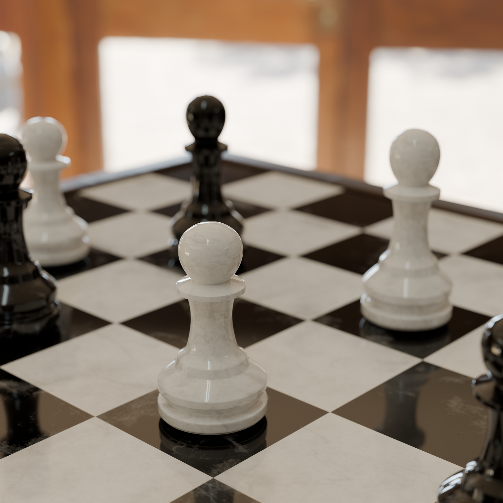

# ♟️ Chess Animation

A 3D chess animation created in Blender as part of my Blender learning journey.

This project focuses on scene composition, camera animation, lighting, rendering, and cinematic storytelling using a chess-themed environment.

## 📸 Preview



---

## 📌 Project Status

✅ Animation Completed

🚧 Rendering In Progress

The animation shots have been completed.

Due to the hardware limitations of my current machine, only one shot has been rendered and included in this repository. Additional rendered shots may be added in the future when suitable rendering resources become available.

### Available Render

```text
chess-animation/0001-0070.mp4
```

---

## 🎯 Project Goals

This project was created to practice:

* Camera Animation
* Scene Composition
* Lighting
* Rendering Workflow
* Cinematic Shot Creation
* Video Sequencing

---

## 🏆 Project Significance

This project represents one of my earliest animation projects in Blender and helped me understand the complete workflow of creating a cinematic scene from start to finish.

Through this project, I gained practical experience in:

* Scene composition
* Camera movement
* Lighting techniques
* Rendering workflows
* Project planning and execution

---

## 🛠️ Software Used

* Blender 5.1.1

---

## 📚 Skills Practiced

### Animation

* Keyframe Animation
* Camera Movement
* Timeline Management

### Rendering

* Cycles Rendering
* Render Settings
* Image Sequence Workflow
* Video Export

### Scene Setup

* Chess Scene Composition
* Material Assignment
* Lighting Setup
* Environment Design

---

## 📂 Repository Structure

```text
.
├── README.md
├── chess-render/
│   └── chess.png
└── chess-animation/
    └── 0001-0070.mp4
```

---

## 🎓 Learning Outcomes

Through this project, I learned:

* Basic animation workflow in Blender
* Camera positioning and movement
* Scene composition techniques
* Material and lighting fundamentals
* Rendering and export workflow
* Managing projects within hardware limitations

---

## 🚀 Future Improvements

* Render and upload the remaining completed shots
* Improve lighting and scene presentation
* Experiment with more cinematic camera movements
* Enhance materials and rendering quality
* Create a complete multi-shot animation sequence
* Add additional camera angles and storytelling elements

---

## 🔮 What's Next?

The experience gained from this project will be applied to future projects involving:

* Product Animation
* Vehicle Animation
* Environment Design
* Interior Visualization
* VFX Projects
* Cinematic Rendering

More exciting Blender projects are coming soon.

---

## 👨‍💻 Author

**Sharique Chaudhary**

Blender Learning Journey • 2026

---

⭐ This project is part of my ongoing journey in learning Blender, 3D animation, rendering, and visual storytelling.

⭐ While only one rendered shot is currently available, the completed animation serves as an important milestone in my Blender learning journey.
